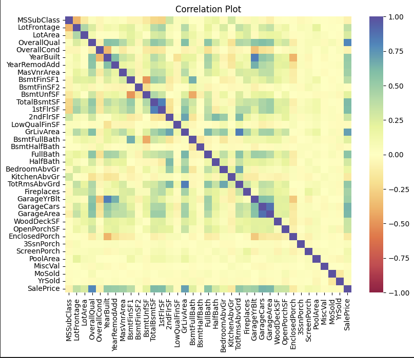
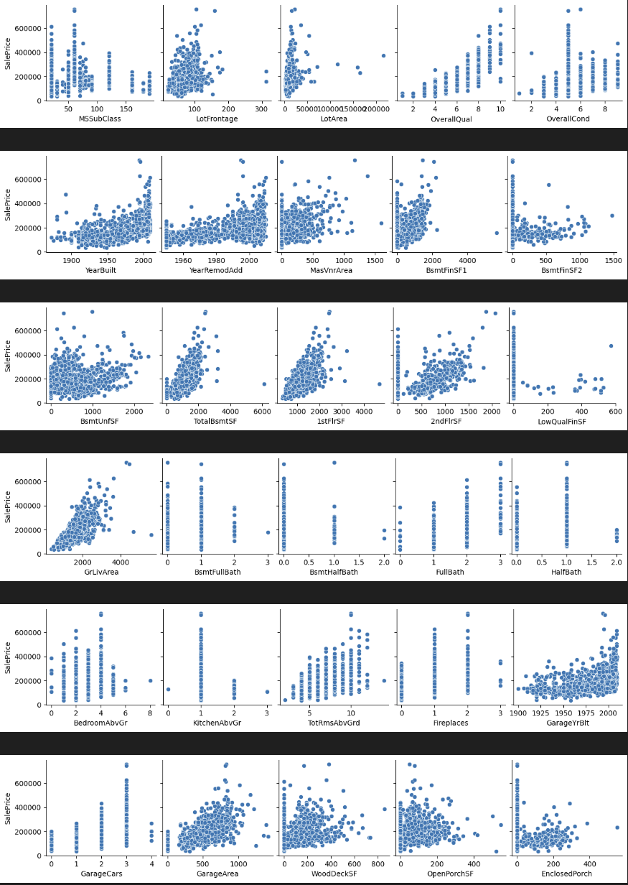
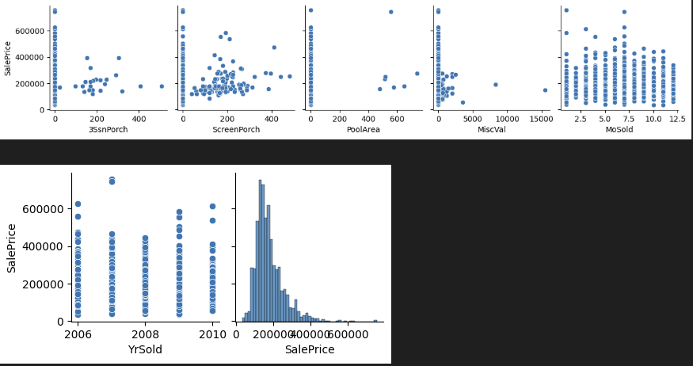

# House_Price_Model

## Requirements
Python3, pandas, matplotlib, seaborn

## Description
EDA on housing data from Ames, Iowa attempting to find correlations in housing characteristics to final sale price. The top five correlations in descending order were found to be Overall quality of build and materials, livable above ground area, 2nd floor sqare feet, garage car number, and total basement square feet. 

## Correlations 
Overall correlations to each other.

View of individual pair plot data to sale price. 

## Model 
Model to be done in the future
